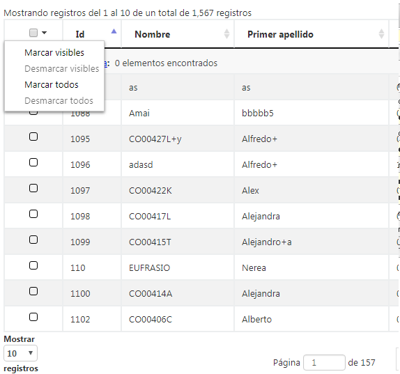

# RUP DataTable - Multiselection

Permite realizar una selección múltiple de los registros que se muestran en la tabla.



## 1. Declaración y configuración

El uso del plugin en el componente se realiza incluyendo en el array de la propiedad usePlugins el valor multiselection. La configuración del plugin se especifica en la propiedad multiselect.

```js
$("#idComponente").rup_datatable({
  url: "../jqGridUsuario",
  usePlugins:["multiselection"],
  multiselect:{
    // Propiedades de configuración del plugin multiselection
  }
});
```

## Funcionamiento interno

Para su funcioanmiento el plugin de multiseleccion del componente RUP Table hace uso de una estrcutura de datos almacenada mediante ```multiSelect.multiselection```.

Se puede acceder a esta estructura mediante la siguiente instrucción.

```js
var multiselectionObj = DataTable.multiSelect.multiselection;
```
Se puede acceder a los métodos de la api del multiSelect
``DataTable.Api().multiSelect.metodoEjemplo()`

Además de las propiedades de configuración asociadas a la configuración del plugin de multiselección se pueden observar las siguientes propiedades.


```js
{
  deselectedIds: [],
  deselectedRowsPerPage: [],
  numSelected:0,
  selectedAll: false,
  selectedIds: [],
  selectedRowsPerPage: [],
  lastSelectedId :0,
  accion:''
}
```

La función de cada propiedad es la siguiente:

* **numSelected**: Número de registros seleccionados en la tabla.
* **selectedAll**: Indica si se han seleccionado todos los elementos de la tabla.
* **selectedIds**: Array que almacena los identificadores de los registros *seleccionados*.
* **selectedRowsPerPage**: Array que almacena la información de los registros *seleccionados* por cada página.
* **deselectedIds**: Array que almacena los identificadores de los registros *deseleccionados*.
* **deselectedRowsPerPage**: Array que almacena la información de los registros *deseleccionados* por cada página.
* **lastSelectedId**: -identificador con el último registro seleccionado*.
* **accion**: Variable para distingir la acción de checkAll, uncheckAll, checkAllPage y uncheckAllPage*.

Existen dos modos de selección de registros en la tabla.

* Selección de registros **ordinaria**.
* Selección de registros **inversa**.

### Selección de registros ordinaria

En este caso la selección de registros se realiza de manera normal. Cuando se selecciona un registro de la tabla se:

* Incrementa el contador de la propiedad ```numSelected```.
* Se almacena el último id seleccionado ``lastSelectedId```.

Supongamos el siguiente ejemplo.

Se accede a la aplicación y sobre un componente RUP Table con el plugin de multiselección activado se procede a seleccionar los siguientes registros:

* Pagina 1, registro de la línea 3 con el id "47"
* Pagina 1, registro de la línea 6 con el id "56"
* Pagina 3, registro de la línea 1 con el id "89"
* Pagina 4, registro de la línea 7 con el id "176"
* Pagina 4, registro de la línea 8 con el id "201"

Después de realizar las multiselección sobre los registros el estado de la estructura será la siguiente:

```js
{
  deselectedIds: [],
  deselectedRowsPerPage: [],
  numSelected: 5,
  selectedAll: false,
  selectedIds: ["47","56","89","176","201"],
  selectedRowsPerPage: [
   {id:57,page:1,line:3},
   {id:56,page:1,line:6},
   {id:89,page:3,line:1},
   {id:176,page:4,line:7},
   {id:201,page:4,line:8}
  ]
}
```


### Selección de registros inversa

La selección inversa se realiza cuando el usuario ha seleccionado todos los registros de la tabla mediante el control correspondiente **selectAll**. En este caso, se almacena la información de los registros deseleccionados en vez de los registros seleccionados.

Cuando se deselecciona un registro de la tabla se:

* Disminuye el contador de la propiedad ```numSelected```.
* Se almacena la información del registro en las propiedades ```deselected```.

Supongamos el siguiente ejemplo.

Se accede a la aplicación y sobre un componente RUP Table con el plugin de multiselección activado.

El número de registros totales es de 1500 elementos. Se seleccionan todos los registros mediante la opción **selectAll** y se procede a deseleccionar los siguientes registros:

* Pagina 1, registro de la línea 3 con el id "47"
* Pagina 1, registro de la línea 6 con el id "56"
* Pagina 3, registro de la línea 1 con el id "89"
* Pagina 4, registro de la línea 7 con el id "176"
* Pagina 4, registro de la línea 8 con el id "201"

Después de realizar las multiselección sobre los registros el estado de la estructura será la siguiente:

```js
{
  deselectedIds: ["47","56","89","176","201"],
   deselectedRowsPerPage: [
   {id:57,page:1,line:3},
   {id:56,page:1,line:6},
   {id:89,page:3,line:1},
   {id:176,page:4,line:7},
   {id:201,page:4,line:8}
  ],
  numSelected: 1495,
  selectedAll: true,
  selectedIds: ["47","56","89","176","201"],
  selectedLinesPerPage: [],
  selectedPages: [],
  selectedRows: [],
  selectedRowsPerPage: []
}
```
