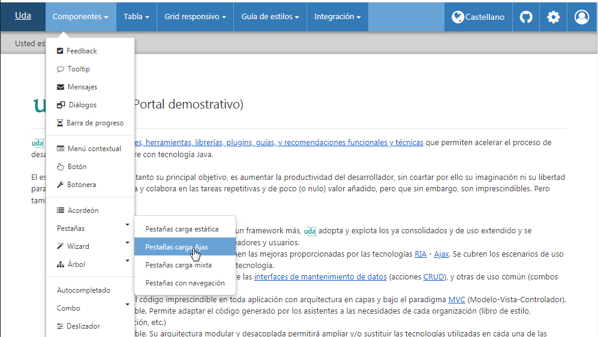
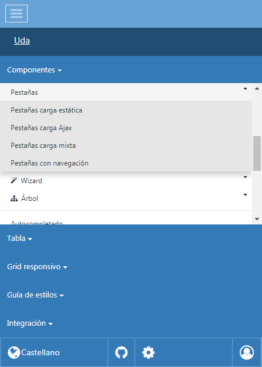

#	Componentes RUP – Menú

<!-- MDTOC maxdepth:6 firsth1:1 numbering:0 flatten:0 bullets:1 updateOnSave:1 -->

   - [1   Introducción](#1-introducción)   
   - [2   Ejemplo](#2-ejemplo)   
   - [3   Casos de uso](#3-casos-de-uso)   
   - [4   Infraestructura](#4-infraestructura)
        - [4.1 Estructura HTML del componente](#4.1-Estructura-HTML-del-componente)
        - [4.2	API Javascript](#4.2-API-Javascript)
   - [5   Invocación](#5-invocación)
   - [6   Internacionalización](#6-Internacionalización)
   - [7.  Formato de las urls](#7-formato-de-las-urls)   

<!-- /MDTOC -->

##	1	Introducción
La descripción del ***Componente Navbar*** visto desde el punto de vista de **RUP** es la siguiente:
*Menú de la aplicación mantenido a lo largo de todas las páginas de forma consistente que muestra entradas directas a secciones clave de la aplicación
*

##	2	Ejemplo
Se presentan a continuación un ejemplo del componente:

+	**Navbar escritorio**:



+	**Navbar movilidad**:



##	3	Casos de uso
Se recomienda el uso del componente:
+	Cuando exista un sitio web estructurado jerárquicamente y relativamente amplio.

+	Cuando se desee facilitar y agilizar la navegación y dar contexto al usuario.

##	4	Infraestructura
A continuación se comenta la infraestructura necesaria para el correcto funcionamiento del componente.
+	Se requiere tener instalado y correctamente configurado RUP en la página (javaScript y hojas de estilos).

+	Se requiere un fichero que defina la estructura del menú. Dicha definición estructural se implementa en *html* en la pagina que lo alberge.


###	4.1	Estructura HTML del componente
```html
<nav class="rup-navbar navbar">
    <button type="button" class="navbar-toggler d-lg-none" type="button" data-toggle="rup-collapse" data-target="#navbarResponsive" aria-controls="navbarResponsive" aria-expanded="false" aria-label="Toggle navigation"></button>
    <div id="navbarResponsive" class="collapse navbar-toggleable-md col-md-12 no-gutter">

        <!-- **************************************************** -->
        <!-- BRAND OPCIONAL -->
        <!-- **************************************************** -->
        <a class="navbar-brand" href="#">BRAND</a>

        <!-- **************************************************** -->
        <!-- Parte izquierda del menú (CONTENIDOS) -->
        <!-- **************************************************** -->
        <ul class="nav navbar-nav">
            <li class="nav-item dropdown">
                <a class="nav-link dropdown-toggle" href="#" id="sm1" 
                    data-toggle="dropdown" aria-haspopup="true" aria-expanded="false">ÍTEM 1</a>
                <div class="dropdown-menu" aria-labelledby="sm1">
                    <a class="dropdown-item" href="#">ÍTEM 1.1</a>
                    <div class="dropdown-divider"></div>
                    <a class="dropdown-item" href="#">ÍTEM 1.2</a>
                    <div class="dropdown-submenu">
                        <a class="dropdown-item dropdown-toggle" href="#" id="sm1_3">ÍTEM 1.3</a>
                        <div class="dropdown-menu menu-right" aria-labelledby="sm1_3">
                            <a class="dropdown-item" href="#">ÍTEM 1.3.1</a>
                            <a class="dropdown-item" href="#">ÍTEM 1.3.2</a>
                        </div>
                    </div>
                </div>
            </li>

            <li class="nav-item dropdown">
                <a class="nav-link dropdown-toggle" href="#" id="sm2" 
                    data-toggle="dropdown" aria-haspopup="true" aria-expanded="false">ÍTEM 2</a>
                <div class="dropdown-menu" aria-labelledby="sm2">
                    <a class="dropdown-item" href="/...">ÍTEM 2.1</a>
                </div>
            </li>
        </ul>

        <!-- **************************************************** -->
        <!-- Parte derecha del menú (UTILIDADES) -->
        <!-- **************************************************** -->
        <ul class="nav navbar-nav float-md-right rup-nav-tools">
            <li class="nav-item dropdown">
                <a class="nav-link dropdown-toggle rup-nav-tool-icon" id="sm3" href="#" 
                    data-toggle="dropdown" aria-haspopup="true" aria-expanded="false">ÍTEM 3</a>
                <div class="dropdown-menu dropdown-menu-right" aria-labelledby="sm3">
                    <a class="dropdown-item" href="#">ÍTEM 3.1</a>
                </div>
            </li>
            <li class="nav-item">
                <a class="nav-link" href="#">ÍTEM 4</a>
            </li>
        </ul>
    </div>
</nav>
```

Como se puede observar existe la posibilidad de incluir un *"brand"* para el aplicativo que se mantendrá visible tanto en la versión de escritorio como en la de movilidad, su uso principal es para mantener un título del aplicativo de forma visible y discreta en todo momento.

```html
<a class="navbar-brand" href="#">BRAND</a>
```

Después tenemos dos tags de listado HTML, uno será el correspondiente a enlazar el contenido que muestre el aplicativo de forma gerárquica:

```html
<ul class="nav navbar-nav">
```

Mientras que el otro listado es opcional aunque recomendable dedicado a las acciones globales que pueden realizarse en cualquiera de las pantallas. Por ejemplo cambiar el idioma, loguearse/desloguearse, etc.

```html
<ul class="nav navbar-nav float-md-right rup-nav-tools">
```

Con el esqueleto creado, el siguiente paso es ir colocando las distintas entradas del menú. Para ello se pueden utilizar diferentes tipos de entradas:

+	**Entradas básicas**: Cosiste en el elemento básico de un menú. Cada una de estas entradas deberá incluir un tag ‘a’, que albergara la redirección del menú, y un tag de mensajes que mantenga la internacionalización (``` ‘<spring:message>’```). La especificación de las rutas (*urls*), se puede hacer de forma relativa o de forma absoluta (véase el capítulo 9. Formato de las *urls*). Si se precisara de la apertura de una nueva ventana, al tag *‘a’* se le debería añadir *target="_blank"*. Todas las entradas de este tipo, serán indicadas mediante el icono *“external link”*.

```html
<li class="nav-item">
    <a class="nav-link" href="/x21aPilotoPatronesWar/../x21aMantenimientosWar/">
        <spring:message code="menu.mantenimientos" />
    </a>
</li>
```

+	**Entradas múltiples (submenús)**: Tipo de entrada capaz de albergar múltiples entradas de menú. Se representa mediante un desplegable que alberga dichas entradas. Dicho desplegable requiere de un literal, representado por un tag ‘a’ que contiene un tag de mensajes que mantenga la internacionalización (```‘<spring:message>’```). A continuación se incluirá un elemento padre, o tag padre, que albergara al submenú como si este fuera uno totalmente independiente. Las posibles entradas utilizables son las mismas que en el caso inicial.

```html
<li class="nav-item dropdown">
    <a class="nav-link dropdown-toggle" href="#" id="sm2" 
        data-toggle="dropdown" aria-haspopup="true" aria-expanded="false">
        <spring:message code="menu.administracion" />    
    </a>
    <div class="dropdown-menu" aria-labelledby="sm2">
        <a class="dropdown-item" href="/x21aMantenimientosWar/administracion/alumno/maint">
            <spring:message code="menu.administracion.alumno" />
        </a>
        <!-- [...] -->
    </div>
</li>
```

-   **Separador**: El elemento separador es aquel que ha sido diseñado para separar y ordenar varias entradas de un menú. El separador es únicamente una línea divisora que permite ordenar la distribución de las entradas. Una entrada cualquiera será separador lineal, si esta alberga la clase *‘dropdown-divider’*.

```html
<div class="dropdown-divider"></div>
```

$\qquad$ El uso de separadores tiene que estar obligatoriamente contenido por una entrada padre del tipo *‘nav-item dropdown’*

+	**Entradas con iconos**: Cualquier entrada, a excepción de los separadores, pueden albergar un icono. Para ello solo será necesario que la entrada disponga de la clase *‘fa’* y otra clase con el icono asociado a la entrada del menú según se especifica en la guía de uso de [FontAwesome v4.7](https://fontawesome.com/v4.7.0/).

```html
<li class="nav-item">
    <a class="nav-link" href="/x21aPilotoPatronesWar/../x21aMantenimientosWar/">
        <i class="fa fa-window-restore" aria-hidden="true"></i>
        <spring:message code="menu.mantenimientos" />
    </a>
</li>
```

+	**Entradas deshabilitadas**: Cualquier entrada, puede comenzar configurada como entrada deshabilitada. Para ello cada entrada deshabilitada, únicamente, debe contener la clase *‘disabled’*.

$\qquad$ Ejemplo para todo un submenú:
```html
<li class="nav-item dropdown disabled">
    <a class="nav-link dropdown-toggle" href="#" id="sm2" 
        data-toggle="dropdown" aria-haspopup="true" aria-expanded="false">ÍTEM 2 DESHABILITADO</a>
    <div class="dropdown-menu" aria-labelledby="sm2">
        <a class="dropdown-item" href="/...">ÍTEM 2.1</a>
    </div>
</li>
```

$\qquad$ Ejemplo para la entrada de un submenú:
```html
<li class="nav-item dropdown">
    <a class="nav-link dropdown-toggle" href="#" id="sm2" 
        data-toggle="dropdown" aria-haspopup="true" aria-expanded="false">ÍTEM 2</a>
    <div class="dropdown-menu" aria-labelledby="sm2">
        <a class="dropdown-item disabled" href="/...">ÍTEM 2.1 DESHABILITADO</a>
    </div>
</li>
```

+	**Entradas con seguridad**: La idea aplicada es bien sencilla, partiendo del modulo de seguridad aportado por spring-security, se pueden aplicar los *tags* que este dispone a las entradas de menú para que aparezcan o no según el usuario. Este formato de seguridad en los menús, permite darle una lógica de presentación a los menús cuando la *jsp* que los alberga es servida. El modo de funcionamiento de *Spring-security* en la capa de presentación es bien sencillo. Mediante los *tag* específicos que el distribuye, permite acotar áreas de *html* que van a ser visualizadas en función de unos criterios de seguridad. Dichos criterios, pueden pasan por la disposición de un role especifico de seguridad o por la simple capacidad de logarte en el sistema. Las alternativas son variadas, por lo que se recomienda la visualización de la documentación de *Spring-Security* para tal efecto (19. [JSP Tag Libraries](http://docs.spring.io/spring-security/site/docs/3.0.x/reference/taglibs.html)).
```xml
<sec:authorize access="hasRole('ROLE_X21A-IN-0003')">
    <li class="nav-item dropdown">
        <a class="nav-link dropdown-toggle" href="#" id="sm2" 
            data-toggle="dropdown" aria-haspopup="true" aria-expanded="false">
            <spring:message code="menu.administracion" />    
        </a>
        <div class="dropdown-menu" aria-labelledby="sm2">
            <a class="dropdown-item" href="/x21aMantenimientosWar/administracion/alumno/maint">
                <spring:message code="menu.administracion.alumno" />
            </a>
            <!-- [...] -->
        </div>
    </li>
</sec:authorize>
```
$\qquad$ Según el código presentado, un poco mas arriba, la entrada múltiple (submenú) ‘menu.administracion’ no será visualizada a no ser que el usuario que este accediendo este logado en la aplicación y disponga del *‘ROLE_X21A-IN-0003’*.

$\qquad$ Como nota final, es interesante comentar que, el *tag* *‘accesscontrollist’* de *Spring-Security* no puede ser utilizado, ya que esa diseñado para el modulo de seguridad *ACL* y este no esta siendo utilizado, actualmente, en **UDA**.


###	4.2	API Javascript
Para ver en detalle la API del componente vaya al siguiente [documento](../api/rup.navbar.md).


##	5	Invocación
La configuración del componente menú se compone de dos partes fundamentales, por un lado, se tiene la definición *html* y, por el otro lado, la especificación de parámetros mediante *JavaScrpt*. Según el tipo de modo de definición que se use, el peso de una u otra parte variará sustancialmente.

El componente, en si mismo, es creado por el *wizard* de generación de proyectos. Dicho *plugin* introduce el patrón en el *layout* correspondiente con la siguiente nomenclatura *(War\WebContent\WEB-INF\layouts\menu.jsp)*.

```xml
<nav class="rup-navbar navbar">
```

Se crea una capa *(nav)* que deberá desarrollarse según la estructura HTML especificada en el punto [4.1 Estructura HTML del componente](#4.1-Estructura-HTML-del-componente).

Una vez definida la parte *html*, se especifica en el fichero *“_layoutLoader.js”* la parte *javaScript*:

```javascript
$("#idNavbar").rup_navbar(properties);
```

El parámetro *“properties”* representa el conjunto de parámetros usados para definir el comportamiento del menú. El parámetro en si, puede declararse mediante un objeto *(var properties = {};)* o bien directamente especificando los valores.

##  6	Internacionalización
Según el modo que se este utilizando para configurar y ejecutar el componente, la responsabilidad de mantener y respetar los literales, según se este en un lenguaje u otro, recae en diferentes elementos de la aplicación.

La internacionalización deberá llevarse a cabo en las *jsp’s* y, por tanto, deberá ser gestionado por los *tag’s* (```‘<spring:message>’```) asociados al gestor de mensajes de *Spring*. Los ficheros de recursos, a nivel de aplicación (*EAR*) o a nivel de modulo web (*WAR*), deberán albergar los diferentes literales, en los diferentes idiomas, del menú como si de cualquier otro elemento de una *jsp* se tratara.

##	7	Formato de las urls
El componente menú, al igual que muchos otros mecanismos asociados al ámbito *web*, al tratar *urls* debe respetar las recomendaciones marcadas por el estándar (*http://www.w3.org/Addressing/*) definidas para el manejo de dichos mecanismos.

Las *urls*, generalmente, se pueden dividir en dos tipos básicos: absolutas y relativas. En general, cualquiera de los dos tipos se puede usar, indistintamente, en links de cualquier sitio web.

El componente menú respeta y mantiene los estándares asociados al entorno *web*; por lo que, para especificar las rutas a las que hace la redirección cada entrada del menú, se puede usar, indistintamente, el tipo de rutas relativas y absolutas.

Para aclarar la forma de uso de cada tipo de ruta (*url*), a continuación, se presenta un ejemplo con los distintos formatos y las rutas (*urls*) resultantes a partir de ellos:

Partiendo de la url:  http://desarrollo.jakina.ejiedes.net:7001/x21aMantenimientosWar/usuario/multi

**Relativas**:
```
about.html      =>  http://desarrollo.jakina.ejiedes.net:7001/x21aMantenimientosWar/usuario/about.html
tuto1/          =>  http://desarrollo.jakina.ejiedes.net:7001/x21aMantenimientosWar/usuario/tuto1/
tuto2.html      =>  http://desarrollo.jakina.ejiedes.net:7001/x21aMantenimientosWar/usuario/tuto2.html
/               =>  http://desarrollo.jakina.ejiedes.net:7001/
/experts/       =>  http://desarrollo.jakina.ejiedes.net:7001/experts/
//www.internet.com/ =>  http://www.internet.com/
//              =>  http://
../             =>  http://desarrollo.jakina.ejiedes.net:7001/x21aMantenimientosWar/
../experts/     =>  http://desarrollo.jakina.ejiedes.net:7001/x21aMantenimientosWar/experts/
..experts/      =>  http://desarrollo.jakina.ejiedes.net:7001/x21aMantenimientosWar/experts/
../../../       =>  http://desarrollo.jakina.ejiedes.net:7001/
../../          =>  http://desarrollo.jakina.ejiedes.net:7001/
../../../../    =>  http://desarrollo.jakina.ejiedes.net:7001/
../../../../great.html  =>  http://desarrollo.jakina.ejiedes.net:7001/great.html
./              =>  http://desarrollo.jakina.ejiedes.net:7001/x21aMantenimientosWar/usuario/
./about.html    =>  http://desarrollo.jakina.ejiedes.net:7001/x21aMantenimientosWar/usuario/about.html
```

**Absolutas**:
```
http://www.jakina.net /x21aPilotoPatronesWar/   =>  http://www.jakina.net/x21aPilotoPatronesWar/
```